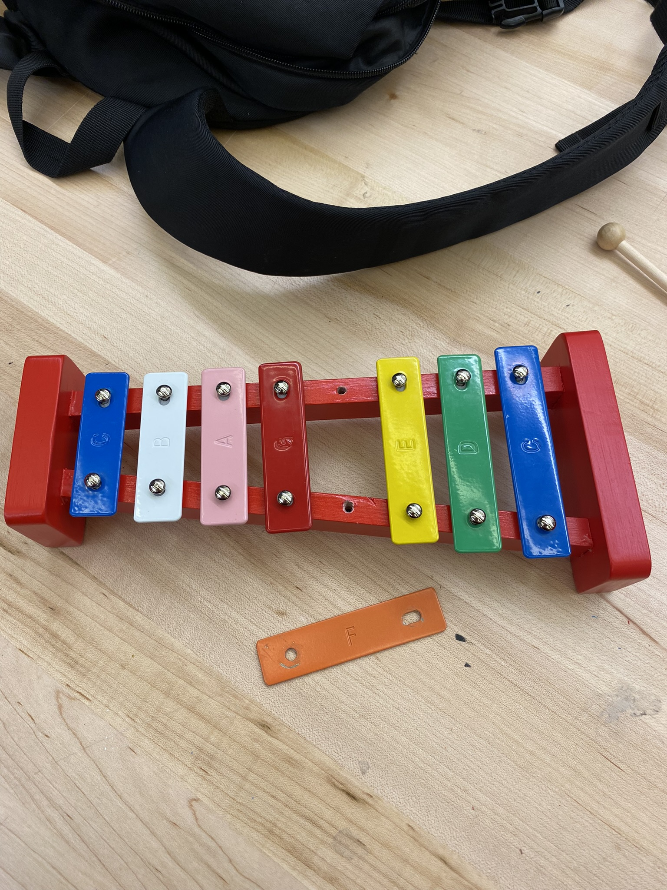
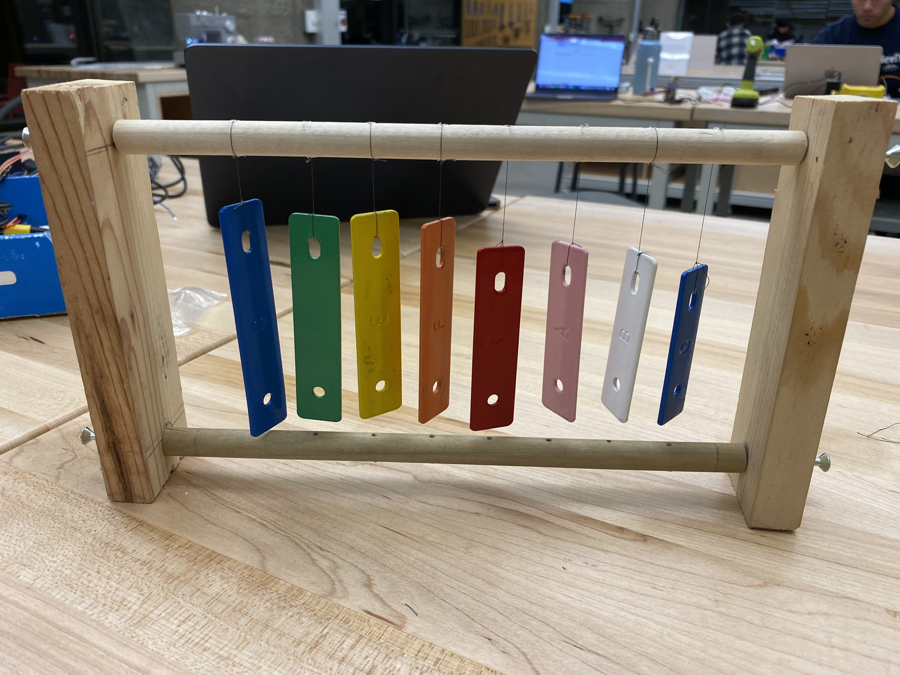
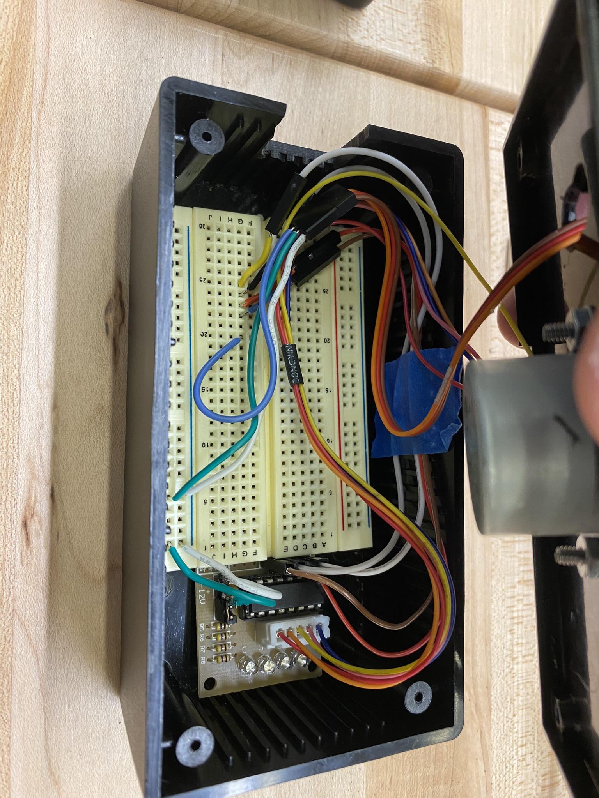
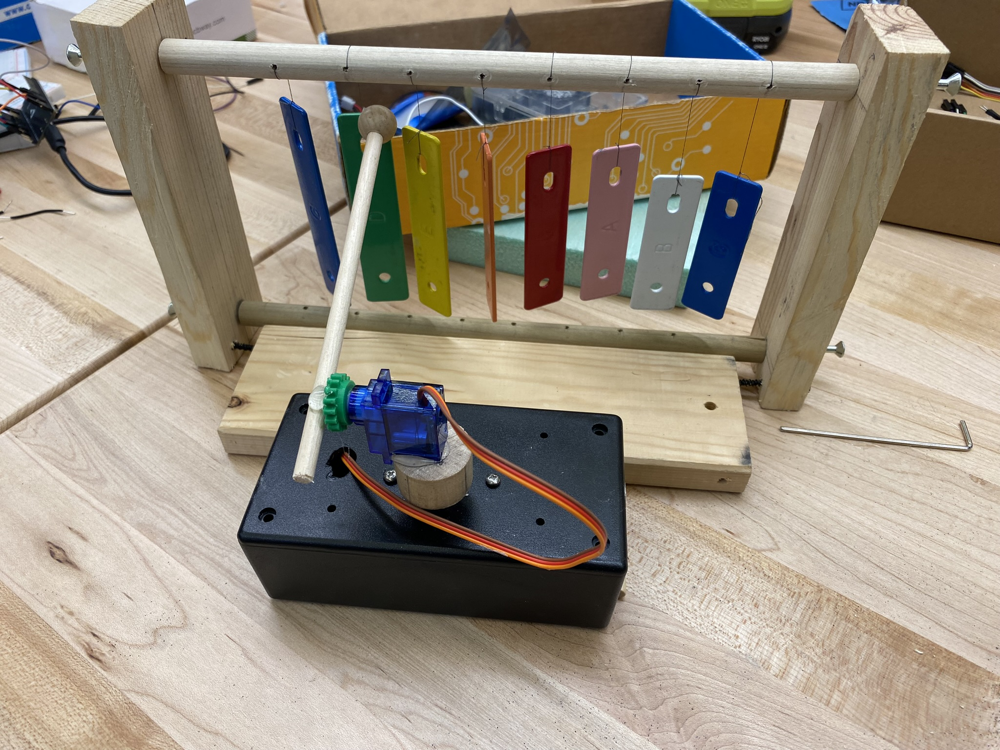
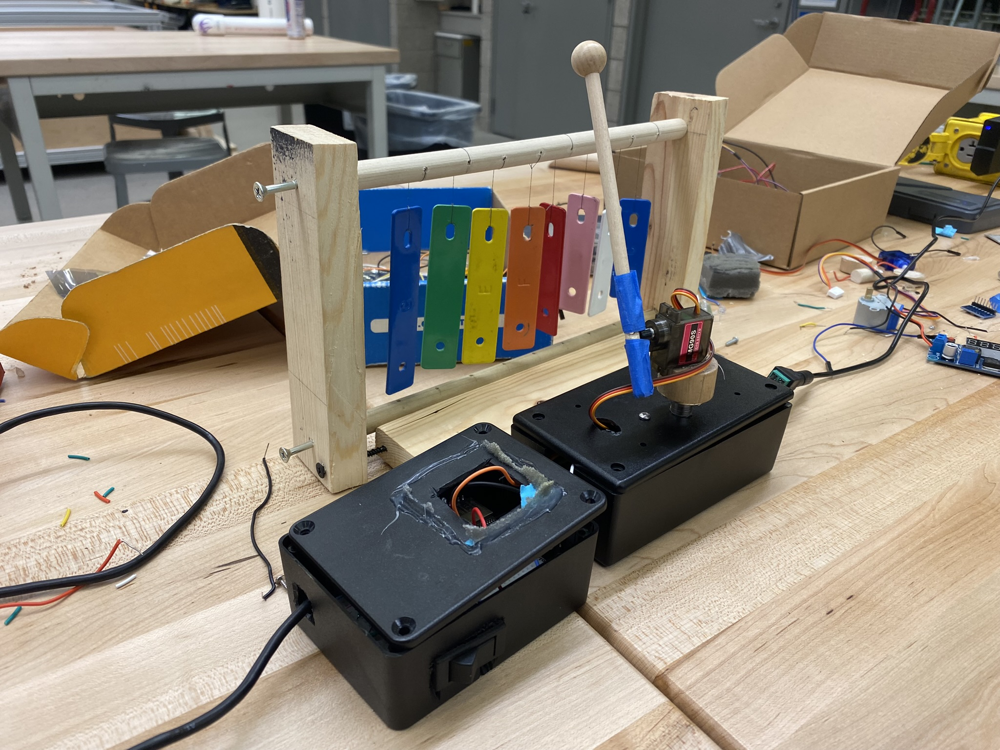

# Xylophookloo: a robotic wind chime

*Okay, I’ll stop with the KooBloo stuff.*

## Beginnings and Ideas

For this project, I sort of took a bit of inspiration from everything. At the beginning of the year, we saw these systems of pipes playing drums by dropping water on them. I knew that at some point this year, I wanted to make a robot that played music on its own. Not necessarily with water, and not necessarily even any kind of structured music. Just one that made a pleasant noise.

In the beginning of my brainstorming, since we had to use two motors, a percussive instrument would make the most sense. Creating a little joint with the stepper and servo seemed obvious. The first step was finding an instrument. I found a little xylophone at a furniture store on Whitney and took it apart. It was real pain.

Then I figured it probably would have made more sense to keep it intact…. but I had already thrown the red frame away. So all I had were these little xylophone tines with holes in them. I wanted to string them up maybe and then have a horizontal xylophone robot?

But once I had strung them all up by one end (as pictured), I really liked the idea of this windchime-y instrument you would just sweep your hand through. It would make it easier for the robot to play, and also would be slightly more interesting than just playing Twinkle Twinkle on a xylophone using a servo.





By the way, the frame is hand-made from pieces of scrap I found in the CEID. I didn’t just tie them up either. I drilled a hole into the cylindrical piece and very meticulously threaded black sewing thread into the holes. I screwed the dowels on and ended up with a very nice xylophone wind-chime.

## The Robot

The robot is two little black boxes with a stepper motor that rotates a platform. On top of this platform is a little servo motor with a drum stick attached to it. The wiring is essentially the same as the technical task, but in this case, the ESP32 is powered by an outlet as well. The stepper motor driver and the ESP32 both take 5V, so it works out. The servo is also connected to this power.

I split the boxes up into two sections so that there was enough space for all of them. I reused the box from my last project so I wouldn’t have to do so much cutting and hacking. I put the ESP32 and power input into one box, and I mounted the motors to the top of another box and stored their wiring in there.



This is the first box with the motors, and the second box is left pretty much like in my last project except wires come out of the top to connect into this box.



I spent a lot of time troubleshooting the code when I realized I was using the wrong kind of servo… but this is what it looks like with just the first box. This configuration allows the robot to sweep through the keys and tap on the box by just rotating each motor.



I even used the leftover switch to turn the robot on and off while its plugged in.

## The Code

Using the technical task’s code as a jumping off point, I created a few helper functions to make moving the motors from one place to another much easier. I don’t like repeating my code that much.

```c
void moveStepper(int steps, int time, int speed) {
  myStepper.setSpeed(speed);
  myStepper.step(steps);
  delay(time);
}

void moveServo(int start, int end, int ms) {
  if (start < end) {
    for(int posDegrees = start; posDegrees <= end; posDegrees++) {
      servo1.write(posDegrees);
      Serial.println(posDegrees);
      delay(ms);
    }
  } else {
    for(int posDegrees = start; posDegrees >= end; posDegrees--) {
      servo1.write(posDegrees);
      Serial.println(posDegrees);
      delay(ms);
    }
  }

  pos = end;
}
```

Using these helper functions, I was able to create little actions for my robot guy to take. I decided on five actions that it would choose randomly between. Here’s an example of one:

```c
void littleDance() {
  servo1.write(20);
  for (int i = 0; i < 4; i++) {
    moveServo(20, 30, 10);
    moveServo(30, 20, 10);
  }
  moveStepper(-1024, 500, 15);
  for (int i = 0; i < 4; i++) {
    moveServo(20, 30, 10);
    moveServo(30, 20, 10);
  }
  moveStepper(1024, 500, 15);
}
```

In this one, the servo moves up and down, rotates, and then moves up and down again. It’s like it’s doing a little dance! There’s a few more patterns that will sweep the keys, tap the frame of the instrument, or both.

## Video

https://www.youtube.com/watch?v=4sIHWglIr7U